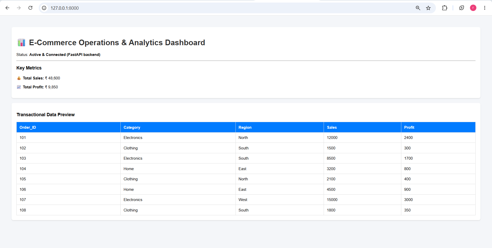

# E-Commerce Operations & Analytics Dashboard

A lightweight, high-performance data analytics web application built with FastAPI and Pandas to track transactional performance, revenue metrics, and regional sales distribution.

## Tech Stack
* **Backend:** FastAPI, Uvicorn
* **Data Processing:** Pandas
* **Frontend:** Embedded HTML5 / CSS Cards / Responsive Tables

## How to Run Locally
1. Clone the repository:
   
   git clone <your-repo-link>
   cd ecommerce-dashboard